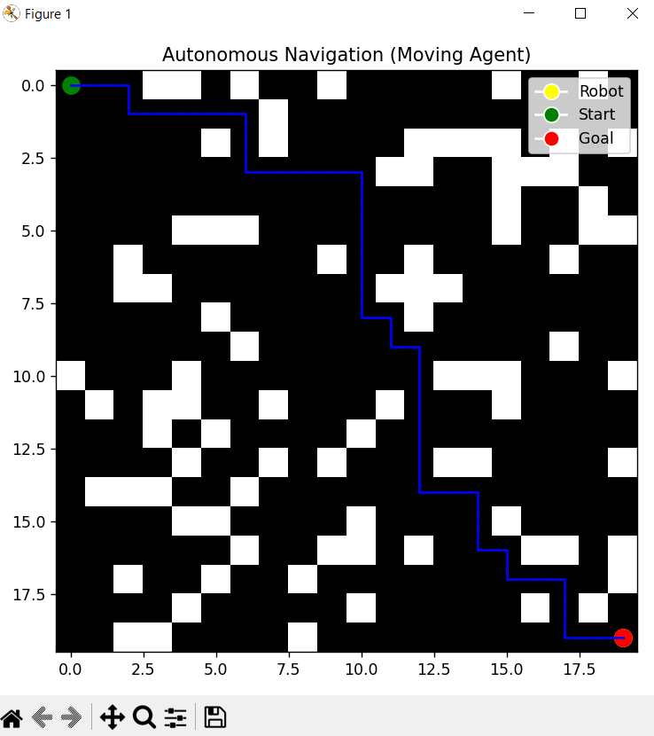
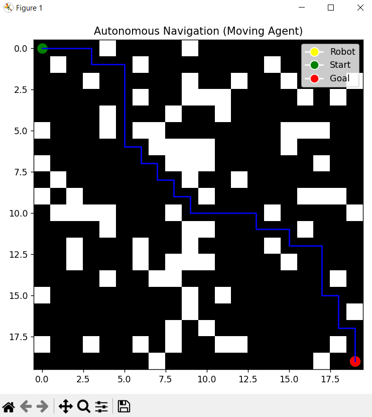
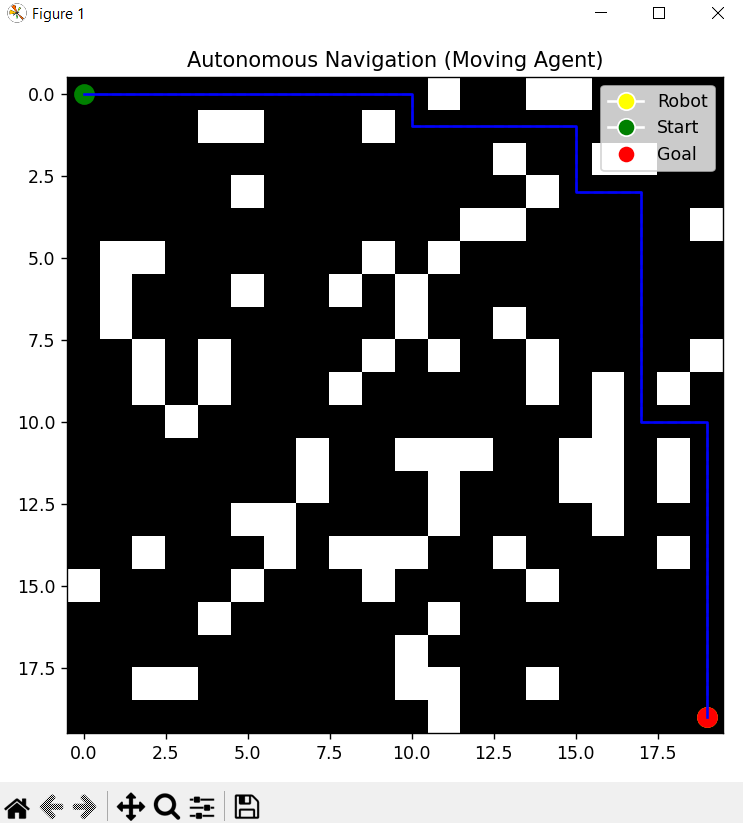
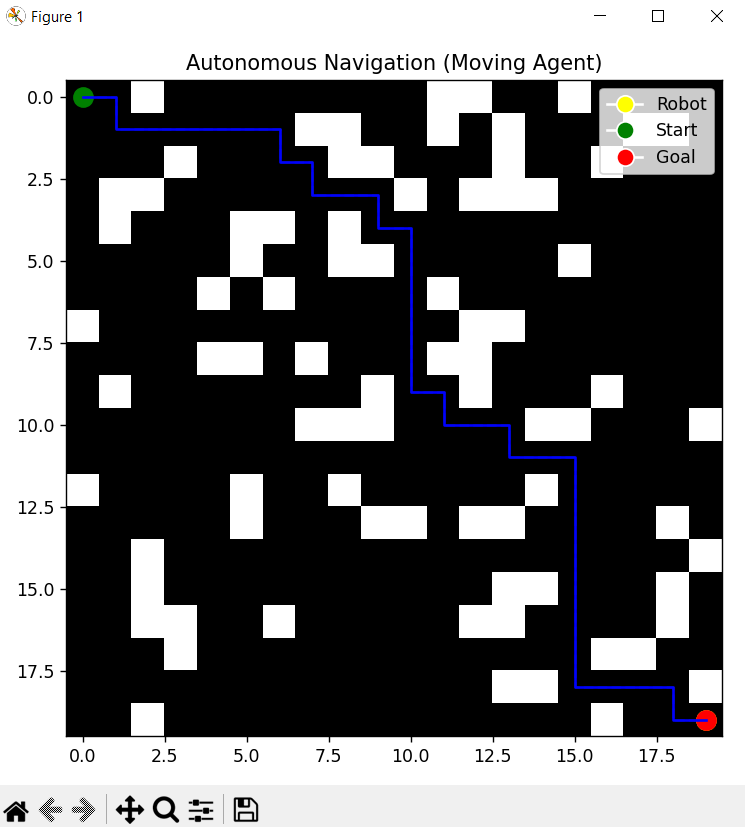
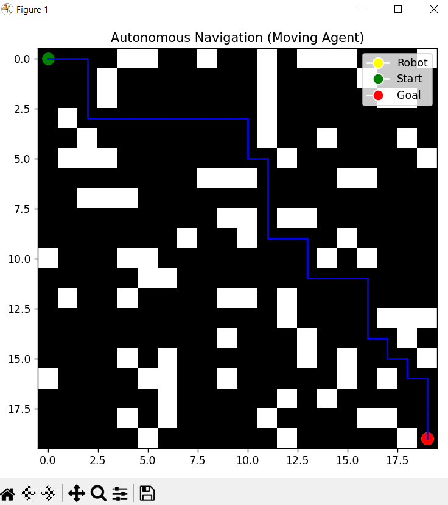

# AI-Based Autonomous Navigation System 🚗🤖

## 📌 Overview

This project simulates an autonomous navigation system using AI path planning (A* algorithm).

## 🎯 Features

* Dynamic grid environment
* Random obstacle generation
* A* pathfinding algorithm
* Autonomous robot movement
* Real-time animation

## 🧠 Tech Stack

* Python
* NumPy
* Matplotlib

## ▶️ How to Run

```bash
python main.py
```

## 📸 Output

### Final Output










## 🎥 Demo Video

[Click here to watch demo](outputs/videos/2026-04-09%2021-38-11_Trim.mp4)

## 🚀 Future Improvements

* Real-time object detection
* Self-driving simulation
* Reinforcement learning

## 👨‍💻 Author

P.S.Chaitanya Sree
